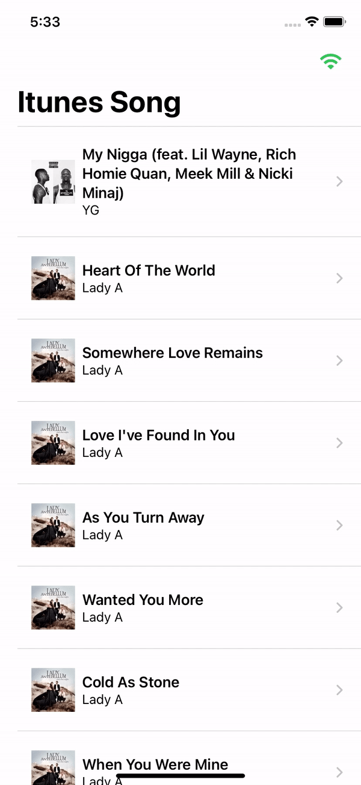
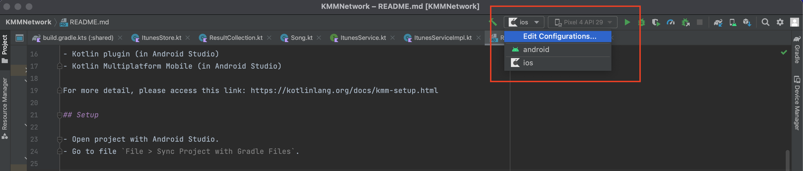

# Kotlin Multiple Platform Mobile + Ktor + Coroutine + SqlDelight (iOS Only)

  

A cross platform application which written by Kotlin Multiplatform Mobile using Kotlin for shared features. Swift for iOS specific features, and Kotlin for Android specific features.
This demo is only run on iOS for demo purpose!

## Getting Started

These instructions will get you building and running the project on your local machine for development and testing purposes. See usage and supported commands for notes on how to use the application.

## Prerequisites

- Android Studio 4.2 or 2020.3.1 Canary 8 or higher.
- Xcode 13 or higher.
- Java SDK 11
- Kotlin plugin (in Android Studio)
- Kotlin Multiplatform Mobile (in Android Studio)

For more detail, please access this link: https://kotlinlang.org/docs/kmm-setup.html

## 3rd party

- Ktor (call RESTFul APIs)
- Coroutine (asynchronous functions)
- Sqldelight (persist structured data)

## Setup

- Open project with Android Studio.
- Go to `File` > `Sync Project with Gradle Files`.

## Run

## License

This project is licensed under the MIT License - see the LICENSE file for details
